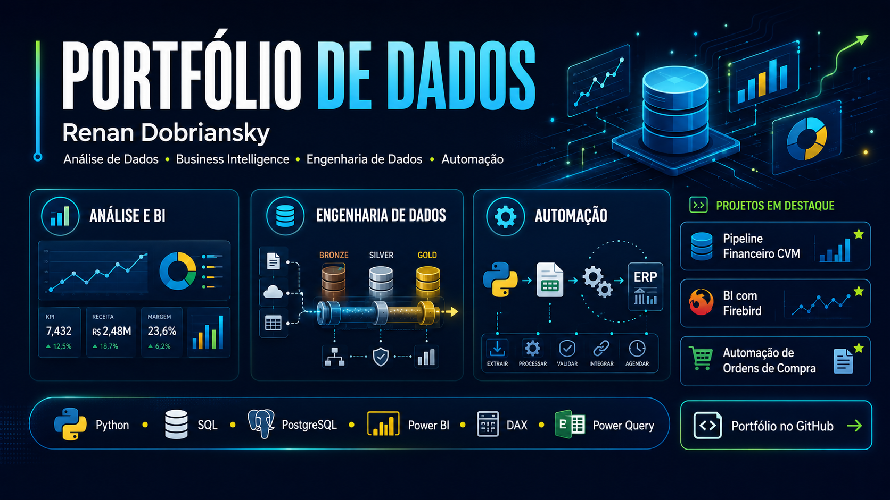

  

<h1 align="center">Olá, eu sou Renan Dobriansky 👋</h1>

  Analista de Dados | Power BI | SQL | Python | DAX | Power Query

## Sobre mim

Sou Analista de Dados com experiência em desenvolvimento de dashboards, tratamento e validação de dados, criação de indicadores, automação de processos e integração de diferentes fontes de dados.

Atualmente curso Ciência de Dados para Negócios na FAE Business School, com conclusão prevista para 2027.

Minha atuação e meus projetos estão concentrados em:

- Análise de Dados e Business Intelligence;
- desenvolvimento de dashboards em Power BI;
- modelagem de dados e criação de métricas em DAX;
- processos de ETL com SQL e Power Query;
- automações e pipelines desenvolvidos em Python;
- bancos de dados relacionais, principalmente PostgreSQL e Firebird.

## Tecnologias

### Linguagens e análise

### Business Intelligence

### Bancos de dados e ferramentas

## Projetos em destaque

### Pipeline Financeiro com Dados da CVM

Pipeline de engenharia e análise de dados financeiros utilizando arquitetura Bronze, Silver e Gold, Python, PostgreSQL e Streamlit.

Principais entregas:

- ingestão e tratamento de demonstrativos financeiros da CVM;
- padronização e validação de Balanço Patrimonial, DRE e DFC;
- cálculo de indicadores financeiros;
- benchmarking empresarial e setorial;
- dashboard executivo para análise da COSAN S.A.

[Ver projeto no GitHub](https://github.com/RenanDobriansky/Big-Data-for-Finance)

---

### Automação de Ordens de Compra

Automação desenvolvida em Python para transformar ordens de compra em PDF em arquivos TXT no padrão NeoGrid para integração com ERP.

Principais entregas:

- extração e interpretação dos dados do PDF;
- de/para de produtos;
- aplicação de regras comerciais;
- validação de itens, valores e estrutura;
- geração automática do arquivo TXT;
- execução agendada em servidor Windows.

[Ver projeto no GitHub](https://github.com/RenanDobriansky/Silo-Automa-o-de-Or-amentos)

---

### Business Intelligence com Firebird

Projeto de Business Intelligence com conexão a banco Firebird, exploração do ERP, consultas SQL, tratamento de dados e preparação de um modelo comercial para Power BI.

Principais entregas:

- inventário técnico do banco de dados;
- criação de consultas SQL;
- estruturação de fatos e dimensões;
- tratamento de dados com Power Query e Linguagem M;
- criação de indicadores em DAX;
- análises comerciais e de frete.

[Ver projeto no GitHub](https://github.com/RenanDobriansky/BI-Project-with-Firebird)

## Destaques

- 1º lugar no Data Science Day 2024 da FAE;
- 2º lugar em uma competição de dashboards da FAE;
- experiência profissional com desenvolvimento e manutenção de soluções de Business Intelligence.

## Contato

